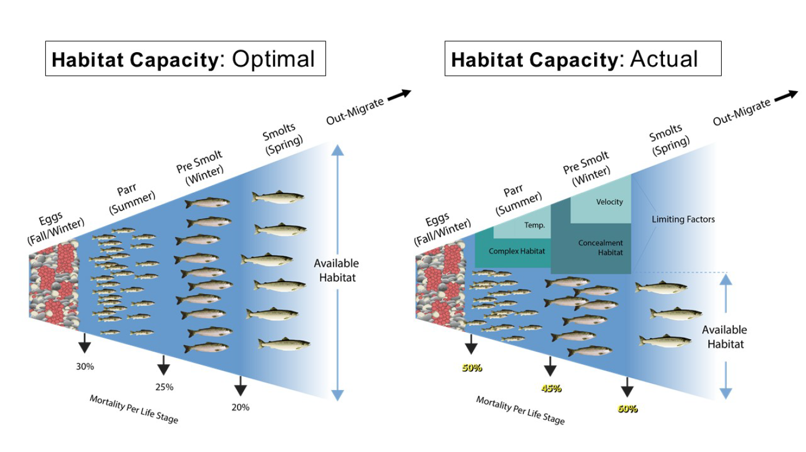

<!-- the following inserts MHE logo into header -->
<script>
   $(document).ready(function() {
     $head = $('#header');
     $head.prepend('')
   });
</script>

```{r setup, echo = FALSE, message = FALSE}
knitr::opts_chunk$set(
  collapse = TRUE,
  warning = FALSE,
  message = FALSE,
  echo = FALSE,
  comment = "#>",
  fig.path = "../figures/",
  dpi = 600
)

options(knitr.kable.NA = '--')

```

```{r load-libraries}
# run this if running chunks directly

# for formatting
library(kableExtra)
library(ggpubr)

# for analysis
library(sf)
library(here)
library(tidyverse)
library(magrittr)

theme_set(theme_pubr(x.text.angle = 45,
                     base_size = 8))

```


# Background

The decline of anadromous Pacific salmonid populations (*Oncorhynchus* spp.) across the Pacific Northwest, USA, has prompted numerous actions aimed at reversing that trend. These actions are often categorized into four ‘H’s’ - harvest modification, habitat rehabilitation, hydroelectric operations, and hatchery practices. While these actions can influence salmonid survival, predicting the potential magnitude of population uplift and developing the most cost-effective and sustainable solutions is a complex task that results in substantial uncertainties. Recovery plans (e.g., @NOAA2009) have identified adult escapement targets at the population scale, providing a quantitative metric useful for evaluating the magnitude of survival improvements (across life-stages) required. These abundance targets provide a benchmark against which habitat rehabilitation actions can be measured. Here, we apply a novel approach to estimating life-stage specific habitat capacity for spring-run Chinook salmon (hereafter Chinook salmon) and summer-run steelhead (hereafter steelhead) to quantify the magnitude and types of tributary habitat restoration needed to achieve recovery goals in the Upper Walla Walla watershed. The necessity of tributary habitat restoration actions can now be demonstrated, and the magnitude of required change can be placed in context with the other ‘H’s’.


## Focal Species

The focal species for this QRF habitat capacity assessment are, both of which are ESA-listed threatened:

* Snake River spring/summer-run Chinook salmon (*Oncorhynchus tshawytscha*; hereafter Chinook salmon)
* Snake River summer-run steelhead (*O. mykiss*; hereafter steelhead; ESA-listed threatened)


## Study Area

This assessment is currently focused on wadable streams within Catherine Creek, the upper Grande Ronde, and Lookingglass Creek.


# Habitat Capacity Assessment

```{r load-data}
# Grande Ronde QRF extrapolations
load(here("analysis/data/derived_data/gr_qrf_extrapolations.rda"))

# Project area polygons and 200m layer (with habitat attributes) within project area
load(here("analysis/data/derived_data/gr_spatial.rda"))

# convert sf objects to tibbles
gr_sum_df = gr_sum_sf %>%
  st_drop_geometry() %>%
  as_tibble()

gr_win_df = gr_win_sf %>%
  st_drop_geometry() %>%
  as_tibble()

gr_redd_df = gr_redd_sf %>%
  st_drop_geometry() %>%
  as_tibble()

```

## Approach Overview

The habitat capacity assessment is focused on Chinook salmon and steelhead. Habitat capacity deficits (e.g., Figure \@ref(fig:capacity-schematic)) resulting from limitations in habitat quantity and/or quality were assessed for three life stages of Chinook salmon and steelhead: 1) spawning (redd) capacity, 2) juvenile summer rearing capacity, and 3) juvenile winter rearing capacity. First, the capacity required to meet adult abundance escapement goals was estimated for each of the three life-stages using a Generalized Capacity Model framework [see Appendix C in @IdahoOSCTeam2019]. Then, the currently available habitat capacity was estimated using a quantile random forest (QRF) approach [@See2021] applied at each life-stage. Next, capacity limitations were quantified by subtracting required capacity from available capacity, providing an estimate of habitat capacity deficit by species and life-stage. Finally, these results can determine the target conditions required to achieve adult escapement goals, and inform prioritization by identifying species and life-stage specific bottlenecks to population productivity in target watersheds within the Grande Ronde basin.

```{r capacity-schematic, out.width = "100%", fig.cap = "Schematic depicting an ideal scenario on the left with no limiting factors, while the right depicts a river with significant limiting factors resulting in reduced habitat capacity and production."}


```


# Literature Cited

<!-- The following line ensures the references appear here for the MS Word or HTML output files, rather than right at the end of the document (this will not work for PDF files):  -->
<div id="refs"></div>

